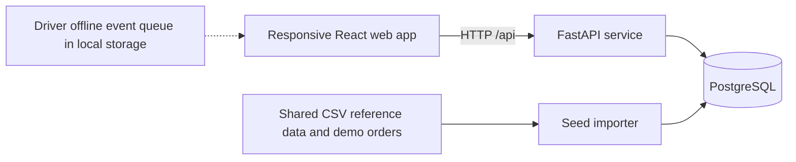

# Architecture

The web image serves the React app through Nginx and proxies `/api` to the API container. The API owns authentication, workflow transitions, and allocation validation. PostgreSQL is the shared record for all four accounts. The seed command runs before the API starts and is idempotent for reference records and demo accounts.

The active Hackathon frontend uses the API for all four roles. Driver stop events are saved in browser local storage when offline and replayed with unique event IDs when connectivity returns. The original Designathon pages are retained as reference code.
