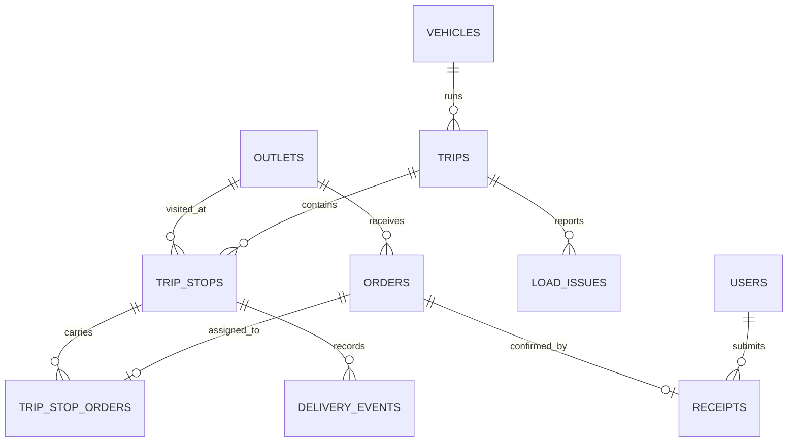

# Data model

`outlets`, `vehicles`, `operating_calendar`, `district_travel`, and `service_allowance` preserve the shared organizer reference data. `orders` holds the demo day and new store orders. `trips`, `trip_stops`, and `trip_stop_orders` connect assignments to vehicles and ordered stops. `load_issues`, `delivery_events`, and `receipts` record the dock, road, and store outcomes. A unique `client_event_id` on delivery events is reserved for safe offline replay.

The schema is in `server/schema.sql`. Planning and workflow APIs are implemented in `server/planning.py` and `server/main.py`.
